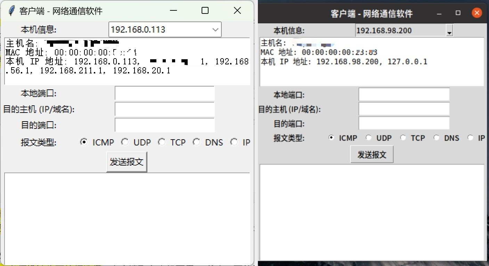
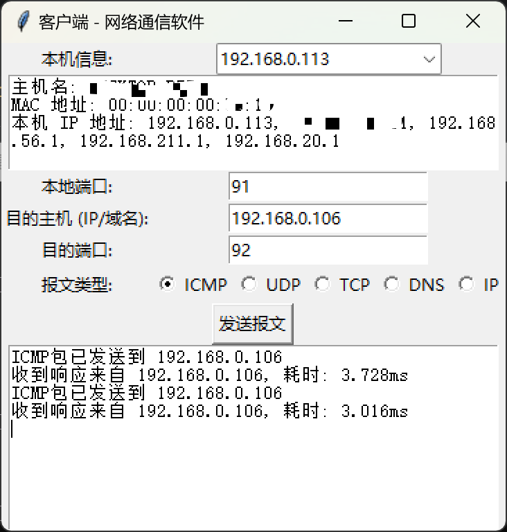
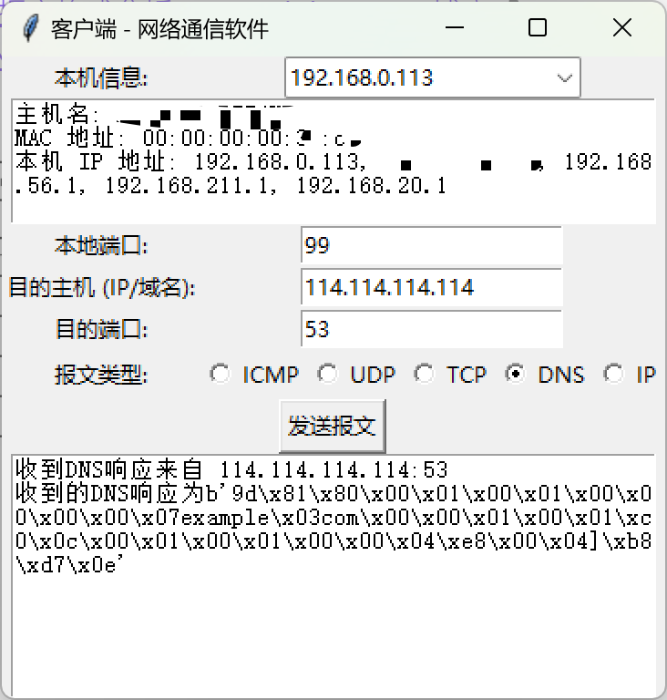

# python简易网络通信软件

## 1. 项目概述
本项目是一个基于Python的网络通信软件，使用Python内置模块`socket`和`tkinter`实现了一个图形化界面（GUI）的应用程序。该软件允许用户发送不同类型的网络报文（ICMP、UDP、TCP、DNS、IP），并显示发送结果及反馈信息。

### 1.1 启动示例

## 2. 开发特色
- **仅使用Python内置模块**：所有功能均通过Python标准库实现，未使用任何第三方库。
- **图形化界面设计**：采用`tkinter`库构建用户界面，提供直观的操作体验。
- **不依赖外部工具**：所有报文的构建和发送均由代码实现，未调用操作系统自带工具或外部工具。

## 3. 使用方法
1. **启动程序**：运行`main.py`文件，启动应用程序。
2. **选择本机IP**：从下拉框中选择一个本机可用的IP地址。
3. **输入目的主机信息**：在相应输入框中填写目的主机的IP地址或域名。
4. **输入端口号**：在相应输入框中填写本机端口和目的端口号。
5. **选择报文类型**：通过单选框选择要发送的报文类型。
6. **发送报文**：点击“发送报文”按钮，查看发送结果及反馈信息。

## 4. 注意事项
- **权限要求**：由于涉及底层网络操作，可能需要管理员权限才能正常运行。
- **发送TCP**：由于windows限制，发送TCP包时只能在Linux运行。

## 5. 功能说明及要求

### 5.1 本机信息显示
- **主机名、MAC地址、IP地址**：在文本框中显示本机的主机名、MAC地址和所有可用的IP地址。(MAC地址获取有误，先不改了)
- **IP地址选择**：通过下拉框选择本机的IP地址，内容自动读取自本机可用的IP信息。

### 5.2 目的主机输入
- **手工输入**：用户可以手动输入目的主机的IP地址或域名。
- **格式验证**：输入的内容必须是有效的IP地址或域名，否则会提示错误。

### 5.3 端口输入
- **手工输入**：用户可以手动输入本机端口和目的端口号。
- **格式验证**：端口号必须是1到65535之间的正整数，否则会提示错误。

### 5.4 报文类型选择
- **单选框选择**：用户可以选择要发送的报文类型（ICMP、UDP、TCP、DNS、IP），默认为ICMP。
- **发送按钮**：点击“发送报文”按钮后，根据选择的报文类型发送相应的报文，并显示发送结果及反馈信息。

### 5.5 发送报文功能

#### 5.5.1 ICMP报文
- **自行构建ICMP头部**：包括类型、代码、校验和、标识符、序列号等字段。
- **接收响应**：能够接收到回应，并测算往返耗时，在文本框中显示往返结果信息。
- **Wireshark分析**：可以通过Wireshark抓包并分析ICMP报文和反馈报文的内容。

#### 5.5.2 UDP报文
- **自行构建UDP头部**：包括源端口、目的端口、长度、校验和等字段。
- **Wireshark验证**：可以在接收方抓取到发送的UDP报文，并通过Wireshark分析其内容。

#### 5.5.3 TCP报文
- **自行构建TCP握手报文**：包括源端口、目的端口、序列号、确认号、标志位、窗口大小等字段。
- **Wireshark验证**：可以通过Wireshark抓包并验证TCP握手过程，不需要回发第三次握手报文。

#### 5.5.4 DNS报文(A记录)
- **自行构建DNS查询报文**：包括ID、标志、问题计数、应答计数、权威应答计数、附加记录计数、查询域名、查询类型、查询类等字段。
- **接收响应**：能够接收到回应，并在文本框中显示结果信息。
- **Wireshark分析**：可以通过Wireshark抓包并分析DNS报文和反馈报文的内容。

#### 5.5.5 IP报文
- **自行构建IP头部**：包括版本、IHL、TOS、总长度、标识符、标志、片偏移、TTL、协议、校验和、源IP地址、目的IP地址等字段。
- **Wireshark验证**：可以在接收方抓取到发送的IP报文，并通过Wireshark分析其内容。
